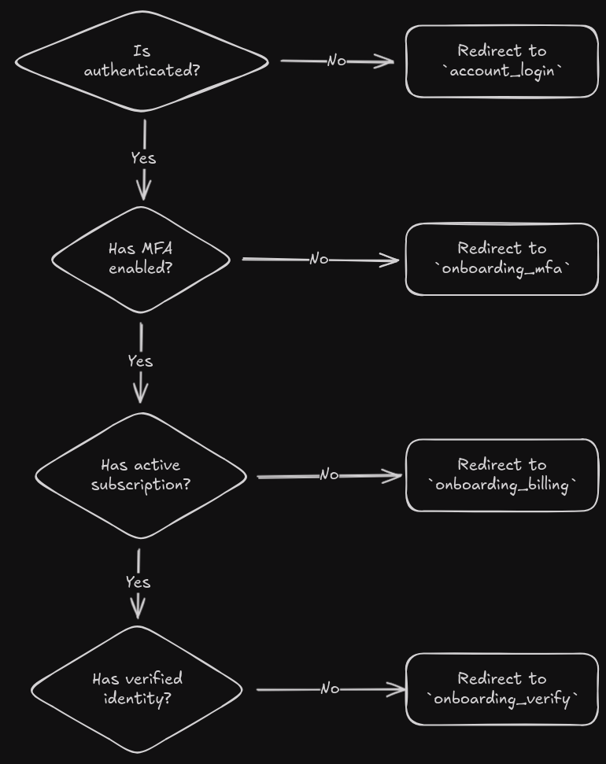

## Development

### Prerequisites

- [`mkcert`](https://github.com/FiloSottile/mkcert)

### HTTPS

For local development it's best to use HTTPS to register Multi-factor authentication (MFA). To do this `mkcert` needs to be installed.

## Overview

### Onboarding

Every user has to go through the Onboarding Process that ensures they:

- Are authenticated with a verified email;
- Have Multi-factor authentication (MFA) enabled for additional security;
- Have an active subscription;
- Have verified their identity;

We enforce this with the `user.middleware.FullyOnboardedUserRequiredMiddleware` middleware.

#### Disabling Onboarding Checks

For some views we need to make sure the user can access without having gone through the onboarding process (some examples below).

To make this easier there is a decorator (inspired by the `login_not_required` Django decorator) in `user.decorators.onboarding_not_required` that can applied to function views and `user.views.OnboardingNotRequiredMixin` that can be added to Class Based Views.
